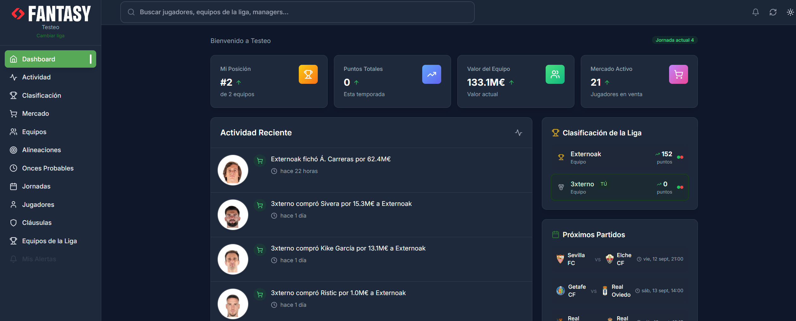

# LaLiga Fantasy App

[](https://github.com/Externoak/LaLigaApp)
[](https://reactjs.org/)

[](#platforms)


**🌐 Language / Idioma:** [🇪🇸 Español](README.md) | [en English](README_EN.md)

> ⚠️ **Note**: The application is only available in Spanish. Only the documentation is translated to English.
>
> ⚠️ **Legal notice**: **Unofficial** project. Not affiliated with LaLiga Fantasy or futbolfantasy.com.

> A comprehensive fantasy football management platform for La Liga Fantasy with extra market information and probable lineups from https://www.futbolfantasy.com/

##  How to use the application

### Quick download and installation

1. **Download**: Go to [Releases](https://github.com/Externoak/LaLigaApp/releases) and download the latest version
2. **Unzip**: Extract the downloaded ZIP file
3. **Run**: Double-click the provided `.exe` file

That's it! No additional installation required.

##  Overview

LaLiga Fantasy Web is a feature-rich application for managing your La Liga Fantasy teams. Built with modern web technologies, it provides an intuitive interface for team management, player trading, market analysis, and real-time league tracking.

### 💡 Why this application?

The official La Liga Fantasy only has a mobile application, leaving PC users without an optimized native experience. This application fills that gap by offering:

- **PC-optimized interface**: Takes advantage of large screens and keyboard/mouse navigation
- **Additional information**: Market data and probable lineups not available in the official app
- **Enhanced experience**: Additional features for more efficient team management

Main menu image:




## 🔐 Privacy and Security

**🛡️ Your data is completely secure:**

- **No own servers / local session data**: Preferences and session are saved locally on your device; they never leave it
- **No telemetry**: We don't send any personal data to external servers
- **No tracking**: The application doesn't track your activity or usage
- **No analytics**: We don't collect usage statistics or personal information
- **Open source**: You can review the source code to verify our transparency
- **Tokens and OAuth**: OAuth tokens (Azure B2C/Google) are stored locally and only sent to provider endpoints for login and session refresh.
- **Data deletion**: From "Log out", tokens and local session data are deleted.

The application only connects to the official LaLiga Fantasy API to obtain public game data from your league and also uses data from https://www.futbolfantasy.com to read market trends data and probable lineups. We never send your credentials, personal configurations, or browsing data to third parties.

### ✨ Key Features

- 🔐 **Secure Authentication** - OAuth2 integration with La Liga's B2C tenant
- 📊 **Real-time Dashboard** - Live league standings, team statistics, and market trends
- 🔍 **Advanced Search** - Global search across players, teams, and managers
- 💰 **Market Management** - Player trading, bidding, and market analysis
- 📱 **Multi-Platform** - Web, Electron desktop
- 🌙 **Dark/Light Mode** - Customizable theme with system preference detection
- 🔄 **Auto-Updates** - Seamless application updates for desktop versions
- 📈 **Market Trends** - Real-time market analysis and player valuations

## 📊 Data Origin and Usage

- The app obtains data directly from the user's device to third-party services.
- We do not operate our own servers nor redistribute data or content from third parties.
- We do not persistently store or repackage third-party content for download.
- We respect headers and usage limits.

## 📋 Third-Party Terms

This application accesses third-party services (e.g., LaLiga Fantasy and futbolfantasy.com). The use of such services is subject to their Terms and Policies.
The project does not encourage or allow circumventing technical measures, prohibited scraping, or uses contrary to said terms.

## 🚀 Quick Start for Developers

### Prerequisites

- **Node.js** 18.0.0 or higher (CI and Docker use Node 20)
- **npm** 7.0.0 or higher
- **Git** for cloning the repository

### Installation

1. **Clone the repository**
   ```bash
   git clone https://github.com/Externoak/LaLigaApp.git
   cd LaLigaApp
   ```

2. **Install dependencies**
   ```bash
   npm install
   ```

3. **Start development server**
   ```bash
   npm run dev
   ```

   This will start a unified server on port 3005 that includes:
   - Web server with the React application
   - CORS proxy server for the LaLiga Fantasy API

4. **Open your browser**
   Navigate to `http://localhost:3005` to access the application

   **📱 Mobile device access**: The application displays the local network URL on startup (e.g., `http://192.168.x.x:3005`). Use this URL to access from your mobile phone or other devices on the same network. The interface is optimized for mobile devices.

## 🖥️ Platforms

### Web Application
```bash
npm start          # Development server
npm run build      # Production build
```

### Electron Desktop App
```bash
npm run electron:dev    # Development mode
npm run electron        # Build and run
npm run build:electron  # Package for distribution
```

## Docker

### Prerequisites
- Docker
- Docker Compose

### Quick Start

```bash
docker-compose up --build
```

Access

- Frontend: http://localhost:8080
- Backend API: http://localhost:8080/api

Manual image build

```bash
docker build -t laligaapp-backend:latest -f docker/Dockerfile.backend .
docker build -t laligaapp-frontend:latest -f docker/Dockerfile.frontend .
```

Environment variables

Backend:
- APP_PORT - Server port (default: 3005)

## 🏗️ Project Structure

```
LaLigaApp/
├── public/                 # Static assets and service workers
├── src/
│   ├── components/        # React components
│   │   ├── Auth/         # Authentication components
│   │   ├── Common/       # Reusable components
│   │   ├── Dashboard/    # Dashboard widgets
│   │   ├── Layout/       # Application layout
│   │   ├── Market/       # Market and trading
│   │   ├── Players/      # Player management
│   │   ├── Teams/        # Team management
│   │   └── Settings/     # Application settings
│   ├── services/         # API and business logic
│   ├── stores/           # State management (Zustand)
│   ├── styles/           # Global styles and Tailwind
│   └── utils/            # Utility functions
├── server/                # Unified server (static files + development CORS proxy)
├── electron/              # Electron main-process modules
├── scripts/              # Build and deployment scripts
├── main.js               # Electron main-process bootstrap
├── preload.js            # Electron preload script
└── tailwind.config.js    # Tailwind CSS configuration
```

## 🛠️ Core Technologies

### Frontend
- **[React 18](https://reactjs.org/)** - Component-based UI library
- **[React Router v6](https://reactrouter.com/)** - Client-side routing
- **[Tailwind CSS](https://tailwindcss.com/)** - Utility-first CSS framework
- **Lightweight animations** - In-house shim (`motionShim`), no external animation library
- **[React Query](https://tanstack.com/query/)** - Data fetching and caching

### State Management
- **[Zustand](https://zustand-demo.pmnd.rs/)** - Lightweight state management
- Persistent storage for authentication and preferences
- Real-time updates and synchronization

### Build Tools
- **[Create React App](https://create-react-app.dev/)** - Development and build tooling
- **[Electron](https://www.electronjs.org/)** - Desktop application framework

## 🔧 Development

### Available Scripts

| Command | Description |
|---------|-------------|
| `npm start` | Start React development server |
| `npm run build` | Build for production |
| `npm test` | Run test suite |
| `npm run dev` | Start development environment with proxy |
| `npm run server` | Start CORS proxy server only |
| `npm run electron:dev` | Run Electron in development mode |

### Environment Setup

The application uses a unified server that serves both the React application and the CORS proxy:

- **Unified Server**: `http://localhost:3005`
- **API Target**: `https://fantasy-api.llt-services.com`

### Authentication

The app uses OAuth2 with La Liga's Azure B2C tenant:
- **One-click Google login** (desktop app): opens LaLiga's official login window, you sign in, and the app captures your session automatically — no manual token copying
- Google OAuth for social login
- Email/password authentication
- JWT token management with automatic refresh
- Persistent session storage

## 🎨 Customization

### Theming

The application supports comprehensive theming through Tailwind CSS:

```javascript
// tailwind.config.js
module.exports = {
  theme: {
    extend: {
      colors: {
        primary: {
          // Custom green palette
          50: '#f0f9f0',
          500: '#2d7d2d',
          900: '#123412',
        },
        dark: {
          // Dark mode colors
          bg: '#0f172a',
          card: '#1e293b',
          border: '#334155',
        }
      }
    }
  }
}
```

### Component Structure

All components follow a consistent pattern:
- Functional components with hooks
- TypeScript-ready (JSDoc comments)
- Responsive design with mobile-first approach
- Accessibility considerations (ARIA labels)

## 🔐 Security

- **Token Security**: JWT tokens stored securely with automatic refresh
- **CORS Protection**: Proxy server validates origins
- **Input Validation**: Client-side and server-side validation
- **Data Privacy**: No sensitive data logging in production
- **Secure Communication**: HTTPS enforcement for API calls

## 📦 Building for Production

### Web Deployment
```bash
npm run build
# Deploy the 'build' directory to your web server
```

### Electron Distribution
```bash
npm run build:electron
# Packaged app available in 'dist' directory
```

## 🤝 Contributing

We welcome contributions!

### Development Workflow

1. Fork the repository
2. Create a feature branch (`git checkout -b feature/amazing-feature`)
3. Commit your changes (`git commit -m 'Add amazing feature'`)
4. Push to the branch (`git push origin feature/amazing-feature`)
5. Open a Pull Request

### Code Standards

- Use ESLint configuration provided
- Follow React functional component patterns
- Write meaningful commit messages
- Add JSDoc comments for complex functions
- Ensure responsive design compatibility

## 🐛 Troubleshooting

### Common Issues

**Build Errors**
```bash
# Clear cache and reinstall
rm -rf node_modules package-lock.json
npm install
```

## 📝 License

This project is distributed under **GPL-3.0-or-later** with **Additional Terms — Attribution (GPLv3 §7)**.  
See **[LICENSE](./LICENSE)** and **[NOTICE](./NOTICE)** for the full text.

### ✅ Attribution Summary (mandatory)
If you redistribute this project or create derivative works, include a **visible mention** of the original project **in one of these ways**:

- **Documentation** (README, manual, or project website), **or**
- **User interface** (e.g., "About", "Credits", or startup screen).

**Recommended credit text:**
> This product includes 'LaLigaApp' (c) 2025–present Externoak — https://github.com/Externoak/LaLigaApp/

## Languages
- **Spanish** (main)
- **English** - See [README_EN.md](README_EN.md)

## 🎓 Educational Purpose

This application was created for **educational and learning purposes**, using modern technologies such as React, Electron, and web scraping. It is a **semi-vibecoding non-profit project** to explore AI development, desktop applications, and APIs.

**Project objectives:**
- Learn Electron and React development
- Experiment with API integration
- Practice web scraping techniques
- Create useful tools for the fantasy community

## 📞 Support

- **Issues**: [GitHub Issues](https://github.com/Externoak/LaLigaApp/issues)

---

> ⚖️ **Legal Notice**: This is an unofficial application that uses NON-public APIs.  
> It is not affiliated with LaLiga Fantasy or futbolfantasy.com.  
> ⚠️ Use at your own risk.

<div align="center">
  <p>Made with ❤️ by <strong>Externoak</strong></p>
  <p><em>Unofficial application for La Liga Fantasy</em></p>
</div>
